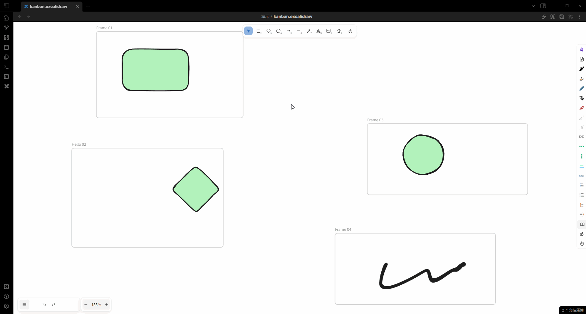
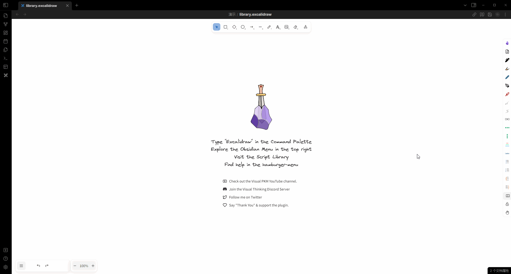
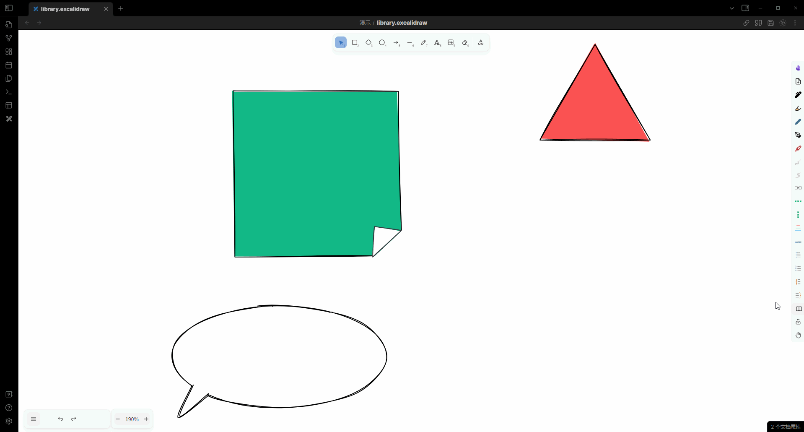
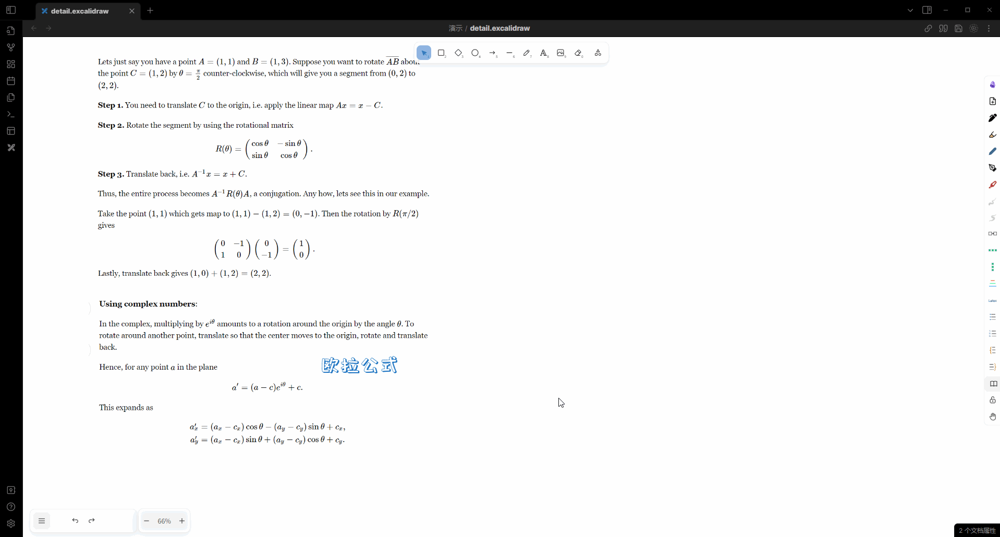

# Obsidian-Excalidraw-Scripts

[English](./README.md) | [简体中文](docs/README_ZH.md)

This is my personal repository of [obsidian-excalidraw-plugin](https://github.com/zsviczian/obsidian-excalidraw-plugin) custom scripts.

It implements many useful/interesting features to enhance the experience of using Excalidraw.

Some scripts rely on [modified version](https://github.com/Bowen-0x00/obsidian-excalidraw-plugin-ymjr) to Obsidian-Excalidraw, while others don't require any dependencies.

## Features (Uploading...)

|feature|scripts|image|
|---|---|---|
|Convert line and arrow to right angle| [convert line to Right-angle.md](Scripts/convert%20line%20to%20Right-angle.md) | |
|Show outline by kanban|[show outline by frame - kanban.md](Scripts/show%20outline%20by%20frame%20-%20kanban.md)||
|Set arrow head| [Set arrow type.md](Scripts/Set%20arrow%20type.md) | |
| Insert vertical space | [insert vertical space.md](Scripts/insert%20vertical%20space.md) | |
| insert vertical space (limited by width) | [insert vertical space with width.md](Scripts/insert%20vertical%20space%20with%20width.md) | |
| insert image to current excalidraw (http server)|[add image server.md](Scripts/add%20image%20server.md)| |
| Connect elements sequence in x direction |[connect elements sequece by x](Scripts/Connect%20elements%20sequence%20by%20x.md)||
| Connect elements sequence in y direction |[connect elements sequece by y](Scripts/Connect%20elements%20sequence%20by%20x.md)||
| Connect elements to mindmap structure |[connect elements sequece by y](Scripts/Connect%20elements_by_x.md)||
|Library grouping & on-demand loading.|[load more library](Scripts/Encrypted/load%20more%20library.md)||
| drag and stretch custom-shaped arrows while keeping the arrowhead|- [add fixed and dragable for line](Scripts/Encrypted/add%20fixed%20and%20dragable%20for%20line.md) - [autorun-handlePointDraggingHook](Scripts/Encrypted/autorun-handlePointDraggingHook.md)||
| Expand/collapse details  |- [add detail - detail](Scripts/Encrypted/add%20detial%20-%20detail.md) - [add detail - target](Scripts/Encrypted/add%20detial%20-%20target.md) - [autorun-handleCanvasPointerUp_detail_Hook](Scripts/Encrypted/autorun-handleCanvasPointerUp_detail_Hook.md)||

You can view the demonstration and more details on
- My [Bilibili Space](https://space.bilibili.com/39231346/).

## Feedback, questions, ideas, problems
Feel free to contact me if:

- You have any issues or questions regarding usage.
- You have suggestions or feedback.
- You want to discuss interesting ideas or new features.

Communication channels can be:
- GitHub issues.
- Email.
- Bilibili comments or private messages.
- My personal contact information (WeChat, QQ).

## Say Thank You
If you find the modifications I made helpful to you, feel free to leave comments and messages.

You can also sponsor me a cup of coffee:
- WeChat sponsorship code.

- ko-fi
  

## Thanks
Thanks to [zsviczian](https://github.com/zsviczian) and other contributors of [obsidian-excalidraw-plugin](https://github.com/zsviczian/obsidian-excalidraw-plugin).

Thanks to contributors of [excalidraw](https://github.com/excalidraw/excalidraw)."