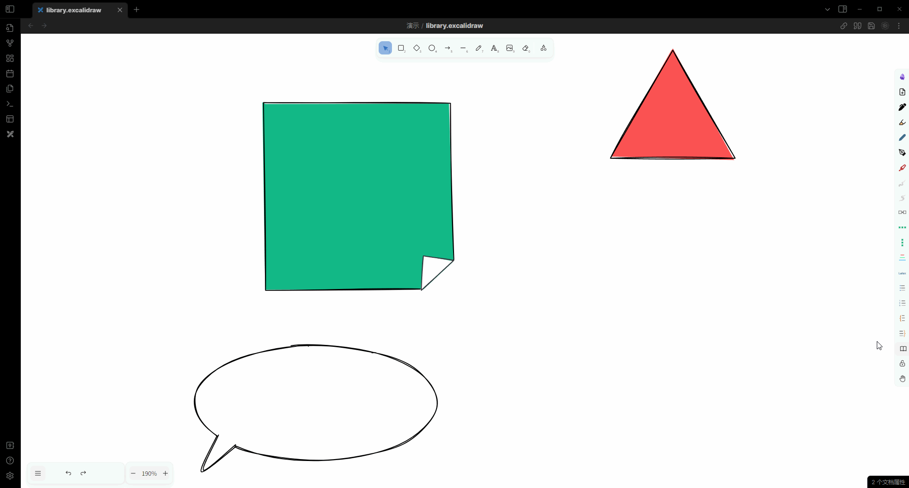
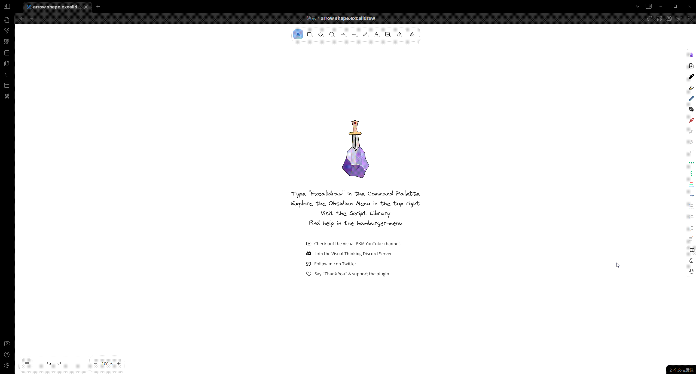

# Obsidian-Excalidraw-ymjr

[English](../README.md) | [简体中文](./README_ZH.md)

这是我的[obsidian-excalidraw-plugin](https://github.com/zsviczian/obsidian-excalidraw-plugin)的自定义脚本仓库。

实现了很多实用/有趣的功能，以提高使用excalidraw的体验

部分脚本依赖于我对obsidian-excalidraw的[修改版本](https://github.com/Bowen-0x00/obsidian-excalidraw-plugin-ymjr)，部分不需要任何依赖。

我打包了一个obsidian 示例库 [obsidian-excalidraw-example-vault](https://github.com/Bowen-0x00/obsidian-excalidraw-example-vault), 其中包含了修改后的插件和很多自定义脚本，以及一些用于演示功能的excalidraw画布。你可以直接用obsidian打开然后体验功能。
你也可以看[视频](https://www.bilibili.com/video/BV1zN4y1H7Dx/) 快速了解其中的部分功能。

## 特性&功能 (上传中...)

|feature|scripts|image|
|---|---|---|
|思维导图| - [autorun-_renderInteractiveScene_Hook](../Scripts/Encrypted/autorun-_renderInteractiveScene_Hook.md)   - [autorun-deleteSelectedElementsHook](../Scripts/Encrypted/autorun-deleteSelectedElementsHook.md)   - [autorun-handleCanvasPointerUp_Hook](../Scripts/Encrypted/autorun-handleCanvasPointerUp_Hook.md)    - [autorun-onKeyDownHook](../Scripts/Encrypted/autorun-onKeyDownHook.md)   - [autorun-onPointerDownHook](../Scripts/Encrypted/autorun-onPointerDownHook.md)   - [_autorun-utils](../Scripts/Encrypted/_autorun-utils.md)   - [add mind map](../Scripts/Encrypted/add%20mind%20map.md)   - [Mindmap format2](../Scripts/Encrypted/Mindmap%20format2.md)   - [clear ea Mindmap](../Scripts/Encrypted/clear%20ea%20Mindmap.md)   - [replace mindmap node](../Scripts/Encrypted/replace%20mindmap%20node.md)|     |
|md <=> ex思维导图| - [export mindmap to md](../Scripts/Encrypted/export%20mindmap%20to%20md.md)   - [tp.excalidraw.mindmap](../Templaters/tp.excalidraw.mindmap.md)| |
|转换连接为直角连接| [convert line to Right-angle.md](../Scripts/convert%20line%20to%20Right-angle.md) | |
|转换连接为直角连接 (圆角边)| [convert connection shape to elbow.md](../Scripts/Encrypted/convert%20connection%20shape%20to%20elbow.md) | |
用kanban显示frame为大纲|[show outline by frame - kanban.md](../Scripts/show%20outline%20by%20frame%20-%20kanban.md)||
|设置箭头类型| [Set arrow type.md](../Scripts/Set%20arrow%20type.md) | |
|插入垂直间隔 | [insert vertical space.md](../Scripts/insert%20vertical%20space.md) | |
|插入垂直间隔 (宽度范围) | [insert vertical space with width.md](../Scripts/insert%20vertical%20space%20with%20width.md) | |
|增加图片到当前画布|[add image server.md](../Scripts/add%20image%20server.md)| |
|x方向顺序连接元素|[connect elements sequece by x](../Scripts/Connect%20elements%20sequence%20by%20x.md)||
|y方向顺序连接元素|[connect elements sequece by y](../Scripts/Connect%20elements%20sequence%20by%20x.md)||
|连接元素为思维导图结构|[connect elements sequece by y](../Scripts/Connect%20elements_by_x.md)||
|按需加载library|[load more library](../Scripts/Encrypted/load%20more%20library.md)||
|自定义形状箭头拉伸|- [add fixed and dragable for line](../Scripts/Encrypted/add%20fixed%20and%20dragable%20for%20line.md) - [autorun-handlePointDraggingHook](../Scripts/Encrypted/autorun-handlePointDraggingHook.md)||
| 显示/隐藏细节 |- [add detail - detail](../Scripts/Encrypted/add%20detial%20-%20detail.md) - [add detail - target](../Scripts/Encrypted/add%20detial%20-%20target.md) - [autorun-handleCanvasPointerUp_detail_Hook](../Scripts/Encrypted/autorun-handleCanvasPointerUp_detail_Hook.md)||
| 自动连接功能 (直角连接、附着到连接点) |- [autorun-binding](../Scripts/Encrypted/autorun-binding.md) - [_autorun-utils](../Scripts/Encrypted/_autorun-utils.md) - [switch connection shape](../Scripts/Encrypted/switch%20connection%20shape.md)  - [autorun-dragSelectedElementsHook](../Scripts/Encrypted/autorun-dragSelectedElementsHook.md) - [autorun-handlePointDraggingHook](../Scripts/Encrypted/autorun-handlePointDraggingHook.md) - [autorun-maybeBindLinearElement_Hook](../Scripts/Encrypted/autorun-maybeBindLinearElement_Hook.md) - [autorun-updateBoundPoint_Hook](../Scripts/Encrypted/autorun-updateBoundPoint_Hook.md)|   |
| 代码语法高亮 |- [mark as code](../Scripts/Encrypted/mark%20as%20code.md) - [autorun-drawElementOnCanvasHook](../Scripts/Encrypted/autorun-drawElementOnCanvasHook.md) - [_autorun-utils](../Scripts/Encrypted/_autorun-utils.md)||
| 展开/折叠元素  |- [add collapse by line](../Scripts/Encrypted/add%20collapse%20by%20line.md) - [autorun-onPointerDownHook](../Scripts/Encrypted/autorun-onPointerDownHook.md)||
| echarts  |- [insert echarts](../Scripts/Encrypted/insert%20echarts.md) - [convert text to echarts](../Scripts/Encrypted/convert%20text%20to%20echarts.md)  - [switch echarts type](../Scripts/Encrypted/switch%20echarts%20type.md)  - [autorun-onPasteHook](../Scripts/Encrypted/autorun-onPasteHook.md)  - [autorun-renderCustomDocument](../Scripts/Encrypted/autorun-renderCustomDocument.md)||
| 导出svg时渲染本地md、代码高亮、echarts  |- [autorun-renderElementToSvg_Hook](../Scripts/Encrypted/autorun-renderElementToSvg_Hook.md) ||
| 箭头和形状流动动画  |- [add animation for line](../Scripts/Encrypted/add%20animation%20for%20line.md)  - [autorun-drawElementFromCanvasHook](../Scripts/Encrypted/autorun-drawElementFromCanvasHook.md)  - [remove animation](../Scripts/Encrypted/remove%20animation.md)  - [autorun-deleteSelectedElementsHook](../Scripts/Encrypted/autorun-deleteSelectedElementsHook.md)||

你可以查看演示和更多细节在:
- 我的[B站空间](https://space.bilibili.com/39231346/)

## 问题、反馈、创意
欢迎联系我，如果：
- 遇到使用问题
- 建议与反馈
- 交流沟通有趣的想法、新的feature

沟通渠道可以是：
- github issue
- 邮件
- B站留言或私信
- 我的个人联系方式 (微信、qq)

## 赞助
如果你觉得我做的这些修改对你有所帮助，欢迎评论、留言。

你也可以赞助我一杯咖啡：
- 微信赞助码 
  
- ko-fi
  

## 感谢
感谢[zsviczian](https://github.com/zsviczian)和[obsidian-excalidraw-plugin](https://github.com/zsviczian/obsidian-excalidraw-plugin)的其他贡献者

感谢[excalidraw](https://github.com/excalidraw/excalidraw)的贡献者
